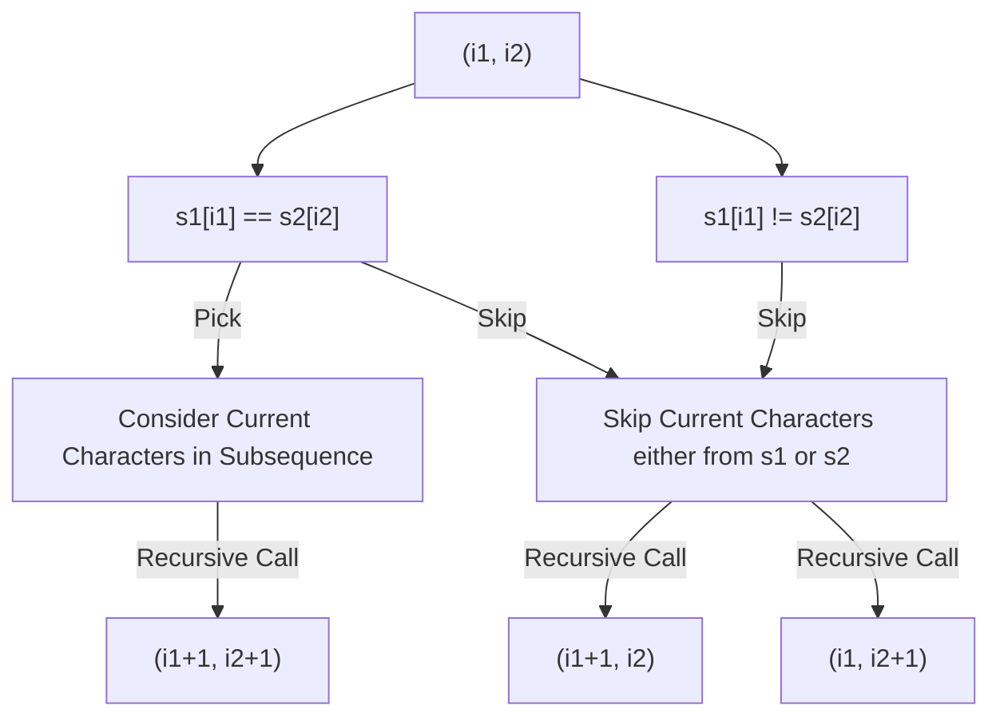

import Tabs from '@theme/Tabs';
import TabItem from '@theme/TabItem';

## Problem Statement

Given two strings `text1` and `text2`, return the length of their *longest common subsequence*. If there is no common subsequence, return `0`.

A *subsequence* of a string is a new string generated from the original string with some characters (can be none) deleted without changing the relative order of the remaining characters.

- For example, `"ace"` is a subsequence of `"abcde"`.

A *common subsequence* of two strings is a subsequence that is common to both strings. 

Example 1:
```text
Input: text1 = "abcde", text2 = "ace" 
Output: 3  
Explanation: The longest common subsequence is "ace" and its length is 3.
```

Example 2:
```text
Input: text1 = "abc", text2 = "abc"
Output: 3
Explanation: The longest common subsequence is "abc" and its length is 3.
```

Example 3:
```text
Input: text1 = "abc", text2 = "def"
Output: 0
Explanation: There is no such common subsequence, so the result is 0.
```

Constraints:
- `1 <= text1.length, text2.length <= 1000`
- `text1` and `text2` consist of only lowercase English characters.

## Explanation

Let `i1` and `i2` be two pointer pointing at `current` index in string `s1` and `s2` respectively.

let `dp(i1, i2, s1, s2)` denotes the length of longest common subsequence in string `s1[i1...n1]` and `s2[i2...n2]`.

If _i1 == n1_, implies s1[i1....n1] is empty.

**Base Case:** longest common subsequence of any string with empty string is 0.
Therefore is any of _i1 == n1_ or _i2 == n2_ return `0`.

Now, for any `i1` and `i2` there are 2 possibilities.



## Solution

<Tabs>

<TabItem value="cpp1" label="C++ Recursive">

```cpp title='CPP: Recursive Brute Force Solution'
class Solution {
private:
    int dp(int i1, int i2, string &s1, string &s2) {
        int n1 = s1.size();
        int n2 = s2.size();

        // Base Case
        if(i1 == n1 || i2 == n2) return 0;

        if(s1[i1] == s2[i2]) {
            return max({
                dp(i1+1, i2+1, s1, s2) + 1,
                dp(i1, i2+1, s1, s2),
                dp(i1+1, i2, s1, s2),
            });
        }
        else {
            return max({
                dp(i1, i2+1, s1, s2),
                dp(i1+1, i2, s1, s2),
            });
        }
    }
public:
    int longestCommonSubsequence(string text1, string text2) {
        return dp(0, 0, text1, text2);
    }
};
```

m               |n                  | Time Complexity  | Space Complexity
----------------|-------------------|------------------|-----------------
size of string 1|size of string 2   | O(max(m,n)\*m\*n)| O(max(m,n))

</TabItem>

<TabItem value="cpp2" label="C++ Recursive DP">

```cpp title='CPP: Recursive + Memoization [Accepted]'
class Solution {
private:
    int dp(int i1, int i2, string &s1, string &s2, vector<vector<int>> &cache) {
        int n1 = s1.size();
        int n2 = s2.size();

        // Base Case
        if(i1 == n1 || i2 == n2) return 0;

        if(cache[i1][i2] != -1) return cache[i1][i2];

        if(s1[i1] == s2[i2]) {
            return cache[i1][i2] = max({
                dp(i1+1, i2+1, s1, s2, cache) + 1,
                dp(i1, i2+1, s1, s2, cache),
                dp(i1+1, i2, s1, s2, cache),
            });
        }
        else {
            return cache[i1][i2] = max({
                dp(i1, i2+1, s1, s2, cache),
                dp(i1+1, i2, s1, s2, cache),
            });
        }
    }
public:
    int longestCommonSubsequence(string text1, string text2) {
        vector<vector<int>> cache(text1.size(), vector<int>(text2.size(), -1));
        return dp(0, 0, text1, text2, cache);
    }
};
```


m               |n                  | Time Complexity  | Space Complexity
----------------|-------------------|------------------|-----------------
size of string 1|size of string 2   | O(m*n)           | O(m*n)

</TabItem>

</Tabs>


## Related Problems
- [Longest Common Substring](https://leetcode.com/discuss/interview-question/1273766/longest-common-substring)
- [1092. Shortest Common Supersequence](https://leetcode.com/problems/shortest-common-supersequence/)
- [1062. Longest Repeating Substring](https://leetcode.com/problems/longest-repeating-substring/)
- [516. Longest Palindromic Subsequence](https://leetcode.com/problems/longest-palindromic-subsequence/)

## References
- [Longest common subsequence Recursive - YouTube, Aditya Verma](https://youtu.be/4Urd0a0BNng)
- [Longest common subsequence Tabular - YouTube, Tushar Roy](https://youtu.be/NnD96abizww)