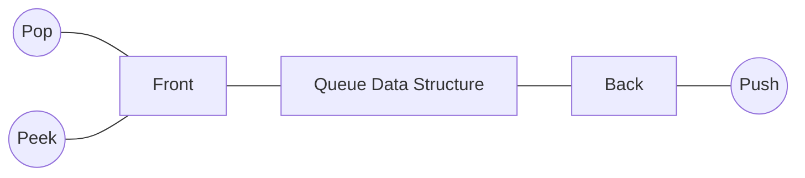
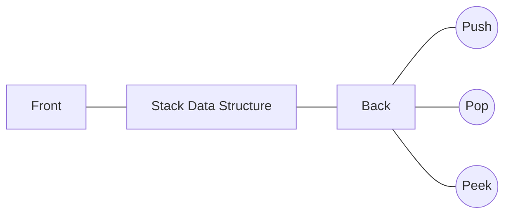

import Tabs from '@theme/Tabs';
import TabItem from '@theme/TabItem';

## Problem Statement

Implement a first in first out (FIFO) queue using only two stacks.
The implemented queue should support all the functions of a normal
queue (`push`, `peek`, `pop`, and `empty`).

Implement the `MyQueue` class:

`void push(int x)` Pushes element x to the back of the queue.
`int pop()` Removes the element from the front of the queue and returns it.
`int peek()` Returns the element at the front of the queue.
`boolean empty()` Returns `true` if the queue is empty, `false` otherwise.

<!--truncate-->

**Notes:**

- You must use only standard operations of a stack, which means only `push to top`,
`peek/pop from top`, `size`, and `is empty` operations are valid.
- Depending on your language, the stack may not be supported natively. You may
simulate a stack using a list or deque (double-ended queue) as long as you use
only a stack's standard operations.

Example 1:
```text
Input:
["MyQueue", "push", "push", "peek", "pop", "empty"]
[[], [1], [2], [], [], []]
Output:
[null, null, null, 1, 1, false]

Explanation:
MyQueue myQueue = new MyQueue();
myQueue.push(1); // queue is: [1]
myQueue.push(2); // queue is: [1, 2] (leftmost is front of the queue)
myQueue.peek(); // return 1
myQueue.pop(); // return 1, queue is [2]
myQueue.empty(); // return false
```

Constraints:
- `1 <= x <= 9`
- At most `100` calls will be made to `push`, `pop`, `peek`, and `empty`.
- All the calls to `pop` and `peek` are valid.

## Follow Up
Can you implement the queue such that each operation is [amortized](https://en.wikipedia.org/wiki/Amortized_analysis)
`O(1)` time complexity? In other words, performing `n` operations will take
overall `O(n)` time even if one of those operations may take longer.

## Explanation

Properties of Queue:


Properties of Stack:


Inorder to create queue using stack, we can use combination of 2 stacks (say `stack1`, `stack2`);

### Queue: Push
- push new element to `stack1`
- oldest element pushed will be in the bottom of stack
- newest element pushed will be on the top of stack

### Queue: Peek
- IF `stack2` is empty then oldest element will be at the
bottom of `stack1` else oldest element will be on top of `stack2`
```text
IF stack2 is empty
    WHILE stack1 is not empty
        pop element from stack1
        push element into stack2
```
- Now, oldest element will always be on the top of `stack2`

### Queue: Pop
- same as finding the peek, then just pop peek element from `stack2`.
- after, pop operation on `stack2`, 2nd oldest will again come on top of `stack2`.

## Solution

<Tabs>

<TabItem value="cpp" label="C++ Two User Stack">

```cpp title='C++ Solution using Two User Defined Stack'
class MyQueue {
private:
    stack<int> s1, s2;
public:
    MyQueue() {

    }
    
    void push(int x) {
        s1.push(x);
    }
    
    int pop() {
        if(s2.empty()) {
            while(!s1.empty()) {
                s2.push(s1.top());
                s1.pop();
            }
        }
        int ans = s2.top();
        s2.pop();
        return ans;
    }
    
    int peek() {
        if(s2.empty()) {
            while(!s1.empty()) {
                s2.push(s1.top());
                s1.pop();
            }
        }
        return s2.top();
    }
    
    bool empty() {
        return s1.size() + s2.size() == 0;
    }
};


/**
 * Your MyQueue object will be instantiated and called as such:
 * MyQueue* obj = new MyQueue();
 * obj->push(x);
 * int param_2 = obj->pop();
 * int param_3 = obj->peek();
 * bool param_4 = obj->empty();
 */
```
Time Complexity:
- Push: O(1)
- Pop: O(N), amortized: O(1)
- Peek: O(N), amortized: O(1)

Space Complexity: O(N)

</TabItem>

</Tabs>


## Related Problems
- [Implement Stack using Queues - GeeksforGeeks](https://www.geeksforgeeks.org/implement-stack-using-queue/)
- [225. Implement Stack using Queues - LeetCode](https://leetcode.com/problems/implement-stack-using-queues/)

## References
- [Queue using Stacks - GeeksforGeeks](https://www.geeksforgeeks.org/queue-using-stacks/)

## Links
- [232. Implement Queue using Stacks](https://leetcode.com/problems/implement-queue-using-stacks/)
- [LeetCode Discussion Post - Suraj Jha](https://leetcode.com/problems/implement-queue-using-stacks/solutions/2918885/c-solution-using-two-user-defined-stack-time-o-1-space-o-n/)