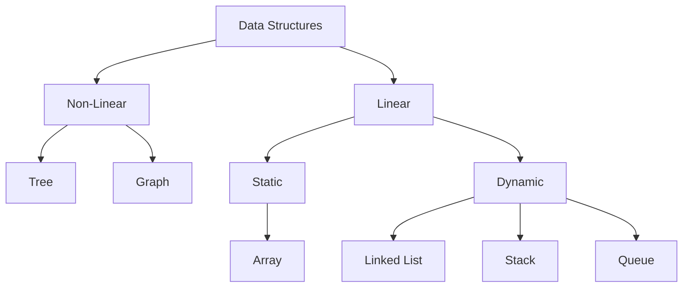

# Introduction to Data Structures

A data structure is a storage that is used to store and organize data. It is a way of arranging data on a computer so that it can be accessed and updated efficiently.

## Classification of Data Structure
